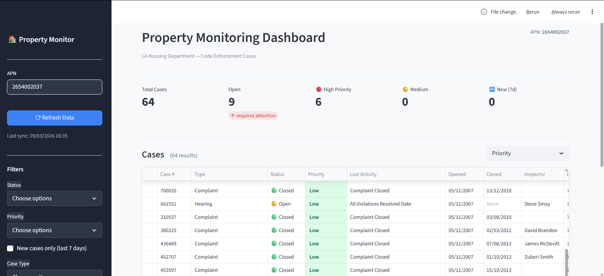

# Property Monitoring Dashboard

## 🚀 הערה על הכלים בפרויקט
זהו הפרויקט הראשון שלי עם Claude Code. לפני שהתחלתי, עשיתי קורס מקוון כדי להכיר את הכלי — ושמחה שעשיתי זאת. עקומת הלמידה הייתה מפתיעה בקלותה, העבודה הרגישה אינטואיטיבית, והחוויה הכללית הייתה מהנה ומספקת.

---

כלי ניטור בדיקות נכסים של רשויות לוס אנג'לס (LA Housing Department).

## תצוגה מקדימה



---

## הרצה מהירה

```bash
# 1. התקנת תלויות
pip install -r requirements.txt
playwright install chromium

# 2. הרצת טסטים
pytest tests/

# 3. סריקה ראשונה
python scraper.py

# 4. פתיחת הדשבורד
streamlit run dashboard.py
```

הדשבורד נפתח אוטומטית בדפדפן בכתובת `http://localhost:8501`.

---

## מבנה הפרויקט

```
nadlan/
├── scraper.py       — סריקת האתר (Playwright + aiohttp + Playwright async)
├── models.py        — מבנה הנתונים + לוגיקת Priority
├── storage.py       — שמירה וקריאה מ-SQLite + Change Detection
├── dashboard.py     — ממשק ויזואלי (Streamlit)
├── tests/
│   └── test_models.py  — 40 unit tests
├── requirements.txt
└── data/
    └── inspections.db   (נוצר אוטומטית)
```

---

## איך עובד הסקריפר

הסריקה מתבצעת בשלושה שלבים:

**שלב 1 — טבלה ראשית (Playwright sync)**
הדף מרונדר בצד-לקוח ומוגן מבקשות HTTP רגילות.
Playwright מפעיל Chromium headless, מרחיב את ה-pagination ל-"All" ושולף את כל 83 השורות.

**שלב 2 — היסטוריית פעילות (aiohttp async)**
לכל תיק קיים דף פרטים עם היסטוריית פעילות מלאה, הנגיש ישירות ללא browser.
64 דפים נשלפים **במקביל** (concurrency=15) באמצעות aiohttp.
מופקים: `open_date`, `current_status`, `activity_count`.

**שלב 3 — שדות JS (Playwright async)**
שדות כמו כתובת, שם פקח ומחוז נטענים ב-JavaScript ואינם זמינים ב-HTML הגולמי.
5 דפים מעובדים **במקביל** עם Playwright async — כל אחד ממתין לסלקטור ספציפי (`#lnkbtnPropAddr`) ושולף את הנתונים לפי ID ייחודי.
מופקים: `address`, `inspector`, `council_district`.

משך הסריקה הכוללת: ~3 דקות.

---

## שדות שנשמרים ולמה

| שדה | מקור | סיבת הבחירה |
|-----|------|-------------|
| `case_number` | טבלה ראשית | מזהה ייחודי — מניעת כפילויות |
| `case_type` | טבלה ראשית | מבדיל בין Hearing, Complaint, Training — בסיס לתעדוף |
| `status` | מחושב | Open/Closed לפי קיום close_date |
| `current_status` | דף פרטים | הפעילות האחרונה בתיק — מגלה את המצב האמיתי |
| `open_date` | דף פרטים | התאריך הראשון בהיסטוריה — בסיס לחישוב גיל התיק |
| `close_date` | טבלה ראשית | אישור סגירה; null = פתוח |
| `activity_count` | דף פרטים | מספר אירועים — מדד למורכבות התיק |
| `priority` | מחושב | High/Medium/Low לפי לוגיקה משולבת |
| `is_new` | מחושב | נפתח בשבוע האחרון |
| `address` | שלב 3 (Playwright JS) | כתובת הנכס — מזוהה לפי `#lnkbtnPropAddr` |
| `inspector` | שלב 3 (Playwright JS) | שם הפקח האחראי — מזוהה לפי `#lblInspectorName` |
| `council_district` | שלב 3 (Playwright JS) | מחוז עיריה — מזוהה לפי `#lblCD` |
| `previous_status` | DB | סטטוס לפני השינוי האחרון — לזיהוי שינויים |
| `previous_priority` | DB | דחיפות לפני השינוי האחרון — לזיהוי החמרה |
| `changed_at` | DB | מתי בוצע השינוי האחרון — לתצוגת Timeline |
| `apn` | פרמטר | מאפשר ניהול נכסים מרובים בעתיד |
| `scraped_at` | זמן ריצה | עדכניות הנתונים |

### לוגיקת Priority

הלוגיקה משלבת שלושה מקורות מידע לפי סדר עדיפות:

```
1. סגור (close_date קיים)           → Low תמיד

2. current_status (הפעילות האחרונה):
   "All Violations Resolved" / "No Violations Observed"  → Low
   "Referred to Enforcement" / "Appeal Received" / "Citation" → High

3. case_type + גיל התיק:
   Hearing                           → High
   Training Program                  → Low
   פתוח > 30 יום                     → High
   פתוח 7–30 יום                     → Medium
   פתוח < 7 ימים                     → Low
```

**הרעיון המרכזי:** תיק פתוח 18 שנה שה-last activity שלו הוא "All Violations Resolved" אינו דחוף — הוא פשוט לא נסגר פורמלית. לעומת זאת, תיק עם "Referred to Enforcement Section" דורש טיפול מיידי ללא קשר לגיל.

### Change Detection

בכל סריקה, ה-DB משווה את הערכים החדשים לישנים ברמת ה-SQL:

```sql
previous_status = CASE
    WHEN excluded.status != cases.status
    THEN cases.status ELSE cases.previous_status END
```

אם `status`, `priority` או `current_status` השתנו — נשמרים הערכים הקודמים ו-`changed_at` מתעדכן.
הדשבורד מציג סקשן "What Changed" עם כרטיס לכל תיק שהשתנה, כולל חץ ⬆️⬇️ ו-border צבעוני לפי הדחיפות החדשה.

---

## הבנת הצורך העסקי

מנהל נכסים מתמודד עם שלוש שאלות יומיומיות:

1. **"האם יש בדיקה חדשה שלא ידעתי עליה?"**
   → תג NEW + כרטיס "New (7d)"

2. **"מה השתנה מאז הפעם האחרונה שבדקתי?"**
   → סקשן "What Changed" בראש הדשבורד — מציג רק מה שרלוונטי, לא הכל

3. **"מה הדחוף ביותר שדורש טיפול עכשיו?"**
   → כרטיס "High Priority" + מיון לפי Priority + צבעים בטבלה

4. **"מה מצב הנכס בסך הכל?"**
   → 5 כרטיסי KPI + עמודת "Last Activity" שמגלה מה באמת קורה בתיק

---

## הנחות ומגבלות

- **JavaScript rendering:** הדף הראשי מרונדר בצד-לקוח — נדרש Playwright.
- **דפי פרטים:** נגישים ישירות דרך HTTP — לא נדרש Playwright.
- **ביצועי שלב 3:** Playwright async מוגבל ל-5 דפים במקביל בשל עומס הזיכרון של Chromium. ניתן להגדיל אך מוסיף סיכון לקריסה.
- **Pagination:** ברירת המחדל של הדף היא 10 תיקים — הסקריפר מרחיב ל-"All" לפני השליפה.
- **תדירות סריקה:** ידנית כרגע. ראה "שיפורים עתידיים".

---

## שיפורים עתידיים

### פיצ'רים
- **התראות אוטומטיות** — Email/Slack כשמתגלה שינוי בסטטוס או דחיפות
- **Cron job** לסריקה אוטומטית יומית
- **ריבוי נכסים** — מסך אחד לכל ה-APNs בתיק
- **Export** לאקסל/PDF

### טכנולוגיה
- **PostgreSQL** במקום SQLite — לשיתוף בין משתמשים
- **FastAPI backend** + **React frontend**
- **Docker Compose** — הרצה בפקודה אחת

---

## Stack לפרודקשן

```
Backend:   FastAPI + Celery (async scraping tasks)
Database:  PostgreSQL + SQLAlchemy
Frontend:  React + Tailwind + Recharts
Infra:     Docker Compose, cron via Celery Beat
Alerts:    SendGrid (email) / Twilio (SMS)
```
